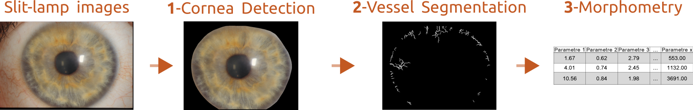

# Streamlit_Slit_Lamp_Vessel

## Overview

Cornea and neo-corneavascularisation segmentation and morpho-analyses from slit-lamp images

## Streamlit app 

We develop an interface with streamlit, an test acces can be accessible via this link : https://6w8d8hjcyf7gtkqrbyjuw4.streamlit.app/

To use it locally the app and the dependencies are in the app folder. To 

##Usage

## Installation

## Dataset

## Modele Checkpoints

## Used Hardware

